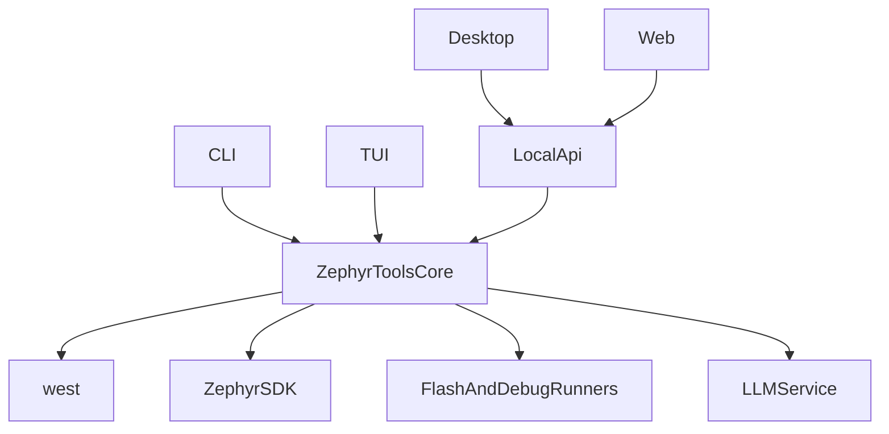

# Zephyr Tools 重构指导文件

## 背景判断

当前仓库 [E:/stloop_test/STloop/stloop](E:/stloop_test/STloop/stloop) 的主逻辑围绕 STM32CubeF4、LL 驱动、裸机 CMake、pyOCD 展开；[E:/stloop_test/STloop/templates/stm32_ll](E:/stloop_test/STloop/templates/stm32_ll) 与 [E:/stloop_test/STloop/demos/blink](E:/stloop_test/STloop/demos/blink) 也都是 STM32 裸机工程形态。目标应从“给 ST 工具加 Zephyr 支持”调整为“以 Zephyr 为中心重建工具平台”。

参考项目 [E:/Arduino_tools/arduino_tools](E:/Arduino_tools/arduino_tools) 的价值主要在多端产品组织方式：Python CLI/Rich、Tauri Desktop、React Web、项目模型与工具链封装。但它存在多端重复实现的问题，本项目应避免在 Python、Rust、TypeScript 中重复维护 build/flash/LLM 逻辑。

## 目标架构

采用“一个核心，多端调用”的架构：



建议目标目录：

```text
zephyr-tools/
  zephyr_tools/
    core/
    cli/
    tui/
    api/
    llm/
  apps/
    desktop/
    web/
  templates/
    zephyr_app/
  examples/
  docs/
  tests/
```

## 阶段 1：冻结现状并清理边界

- 明确当前可复用资产：CLI 分发、Client 门面、路径管理、错误类型、日志、LLM 客户端、交互式问答骨架。
- 标记将废弃的 ST 专用模块：`cube-download`、`STM32CubeF4` 下载、`linker_gen`、`chip_config`、LL 专用 prompt、裸机 CMake 模板、默认 `stm32f411re` 烧录目标。
- 清理源码双轨问题：当前存在 [E:/stloop_test/STloop/stloop](E:/stloop_test/STloop/stloop) 与 [E:/stloop_test/STloop/src](E:/stloop_test/STloop/src) 的重复/遗留结构，重构时只保留单一主源码树。

## 阶段 2：建立 Zephyr 核心层

先实现核心 API，不先做 UI：

- `WorkspaceManager`：检测/初始化 Zephyr workspace，管理 `west.yml`。
- `ProjectManager`：创建 Zephyr app，管理 `prj.conf`、board overlay、sample/template。
- `BoardRegistry`：封装 `west boards`，提供 board 查询、过滤、能力展示。
- `BuildService`：封装 `west build -b <board>`，返回结构化构建结果。
- `FlashService`：封装 `west flash`，支持 runner 参数。
- `MonitorService`：封装串口、RTT、Zephyr shell 的日志接入。
- `DoctorService`：检查 `west`、Zephyr SDK、CMake、Ninja、Python venv、probe 工具。
- `CodegenService`：生成 Zephyr 风格代码、Kconfig、devicetree overlay、`prj.conf`，替代当前 STM32 LL 生成逻辑。

## 阶段 3：改造 CLI

将现有 `stloop` 命令迁移为 Zephyr 语义，建议入口命令暂定为 `zt` 或 `zephyr-tools`：

```text
zt doctor
zt init
zt boards
zt create
zt build
zt flash
zt monitor
zt shell
zt gen
zt fix
zt tui
```

关键要求：

- CLI 只负责参数解析和展示，不直接拼接复杂 `west` 流程。
- 所有命令通过核心服务完成。
- `gen` 生成 Zephyr 应用代码与配置，不再生成 `stm32f4xx_ll_*` 代码。
- `fix` 读取构建日志，允许 LLM 修改 `main.c`、`prj.conf`、overlay、Kconfig 相关文件。

## 阶段 4：实现 TUI

TUI 建议基于 Python Textual 或同类框架，直接复用核心 API：

- 项目列表与最近工作区。
- Board 选择器。
- Build/Flash 状态面板。
- 构建错误诊断面板。
- 串口/RTT 日志窗口。
- LLM 生成与修复对话。

## 阶段 5：接入 Desktop 与 Web

Desktop/Web 不直接实现工具链逻辑，而是通过本地 API 服务调用核心：

- `api` 提供 HTTP/WebSocket 接口。
- Desktop 使用 Tauri 或 Electron 作为壳。
- Web 分为本地模式与云模式：本地模式连接 daemon，可 build/flash/monitor；云模式只做项目编辑、代码生成和导出。
- LLM Key 不应由纯 Web 前端长期保存在 localStorage 中，优先使用本地服务或后端代理。

## 阶段 6：测试与验收

最小验收链路：

- `zt doctor` 能识别 Zephyr SDK、west、CMake、Ninja、probe 工具状态。
- `zt create blink -b nucleo_f411re` 能创建标准 Zephyr app。
- `zt build blink` 能生成 `build/zephyr/zephyr.elf`。
- `zt flash blink` 能通过 `west flash` 烧录。
- `zt monitor blink` 能读取串口或 RTT 日志。
- `zt gen "blink LED every 500ms"` 生成 Zephyr 风格代码和配置。
- `zt fix` 能根据常见构建错误修复 include、Kconfig、devicetree overlay、board 配置问题。
- CLI、TUI、Desktop 至少共用同一个核心构建服务。

## 风险与控制

- Zephyr 环境复杂，必须优先实现 `doctor` 和结构化错误诊断。
- 多端很容易重复实现，必须坚持核心服务统一承载 build/flash/monitor/codegen。
- 不要保留 STM32Cube/LL 兼容层，除非明确作为 legacy 插件，否则会污染 Zephyr 模型。
- 初期先支持 STM32 Zephyr board，接口设计保留 Nordic、ESP32、RP2040 等 Zephyr board 扩展空间。
